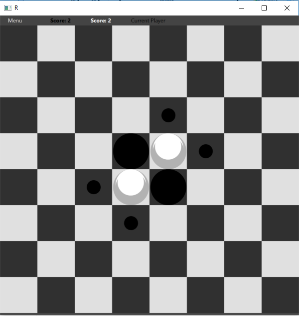
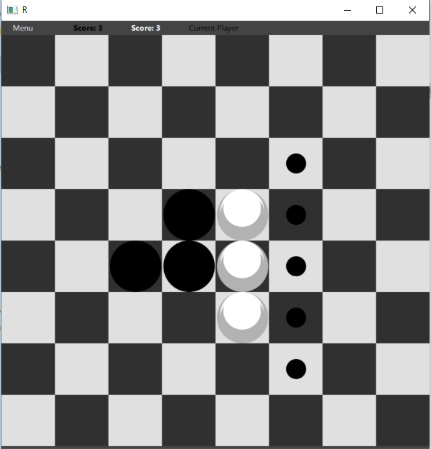
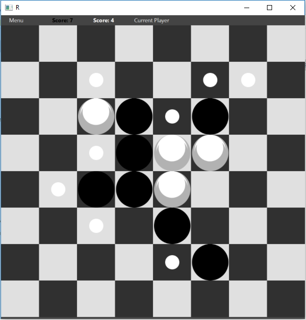
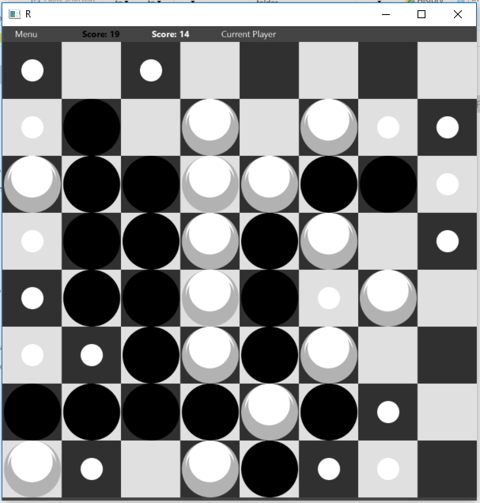

# Reversi-Local-AI-Server-GUI
A project in "Advanced Programming" course. 
Reversi game in C++ with Java FXML GUI. 
The game offers the user the visual positions of their next possible moves using black or white dots. 
Including Local, AI and Online multiplayer features. 
The game supports 3 different types of gaming experiences: 
1. Player vs Player on the same machine 
2. Player vs Min-Max AI 
3. Player vs Player online via a Server that can host multiple parallel game rooms. 
  

  

  

  

